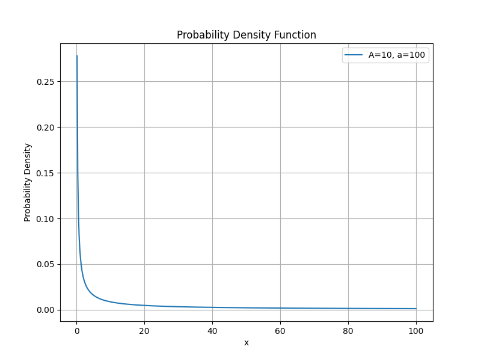
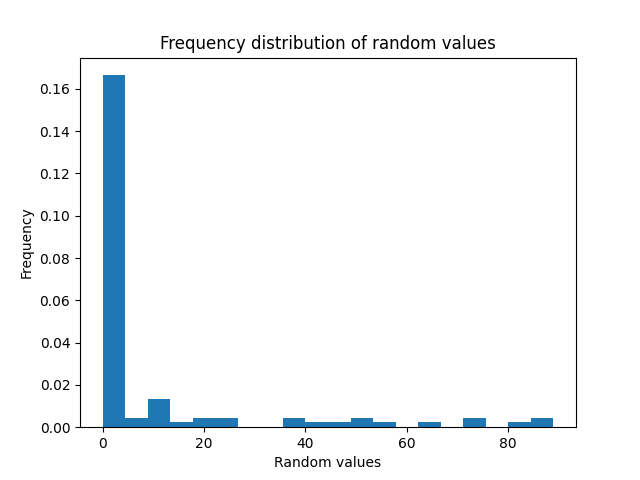

# Red Envelope Distribution Simulation

English | [简体中文](./README.md)

This project uses agent-based modeling techniques to simulate the "red envelope" distribution process among a group of people, view the distribution of the red envelope amount obtained by a person in different grabbing positions, and simulate the red envelope distribution results of different grabbing positions. The simulation is built on the [Mesa](https://mesa.readthedocs.io/en/stable/) framework, which makes the creation and visualization of agent-based models modular and simple.

## Quick Start
### Environment Dependencies

Before running the project, you need to install Python and Poetry (for managing virtual environments and dependencies). Poetry can be installed with the following command:

```bash
pip install poetry
```

### Install dependencies and set up a virtual environment

After cloning the project, you can use the following command to create a virtual environment and install dependencies:

```bash
# Clone the project
git clone <your-repo-url>

# Enter the project directory
cd <your-repo-directory>

# Use Poetry to install dependencies and create a virtual environment
poetry install
```

## Probability distribution of the test


## Random number generation distribution of the test
